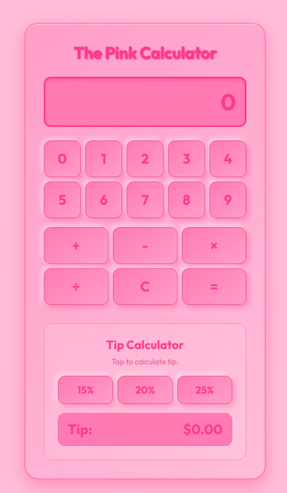

# The Pink Calculator

A quirky, highly styled, and intentionally "barely readable" pink-on-pink calculator web application built to demonstrate Jules' new features for Google's 2026 BugBash session in Seoul.



## Purpose

This repository is designed to demonstrate Jules' accessibility and usability analysis features for the Google 2026 BugBash session in Seoul. 

> [!NOTE]
> **Demonstration of Feature vs. Capability**
> The presence of this README explicitly documenting the repository's deliberate design flaws assists Jules in locating and categorizing these problems. Consequently, this repository serves as a guided demonstration of Jules' analysis features rather than an assessment of its ability to autonomously discover issues in an undocumented environment.

## Features

- **Intentional Low Contrast**: Uses an excessively pink-on-pink color palette that is deliberately difficult to read and borderline annoying, demonstrating low contrast and visual fatigue issues.
- **Unconventional Layout**: Features a non-standard keypad layout with numbers arranged in two rows (0-4 and 5-9) rather than the traditional grid, creating intentional cognitive friction.
- **Interactive Tip Calculator**: Supports calculating standard tip percentages (15%, 20%, 25%) on the current display value.
- **Hidden Customizable Tips**: Allows customizing tip percentages via long-press gestures. This capability is intentionally completely undocumented in the UI to introduce a discoverability and usability issue for Jules to analyze.

## Tech Stack

- HTML5 & Semantic Elements
- Vanilla CSS with custom CSS variables
- Vanilla JavaScript (ES6 Modules)
- Built and bundled with [Vite](https://vitejs.dev/)

## Getting Started

### Prerequisites

- Node.js and npm installed on your local machine.

### Installation & Running Locally

1. Install dependencies:
   ```bash
   npm install
   ```

2. Start the development server:
   ```bash
   npm run dev
   ```

3. Build for production:
   ```bash
   npm run build
   ```
